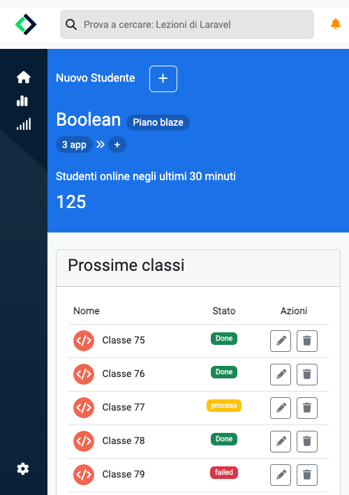

# BOOLEAN DASHBORD

In questo progetto è stata riprodotta un'ipotetica dashboard di Boolean per la gestione degli studenti nelle sue possibili versioni Desktop, Tablet e Mobile; questa esercitazione ha permesso agli studenti del corso di lavorare sia utilizzando Boostrap e i suoi componenti, sia di creare parte del layout in maniera autonoma basandosi sulle proprie conoscenze di HTML e CSS creando in loro la necessità di fare delle scelte oculate in base al tipo di parte della dashboard da riprodurre.

Di seguito riportiamo le tre versioni di layout oggetto dell'esercizio:

## 1) Desktop

## 2) Tablet

## 3) Mobile

